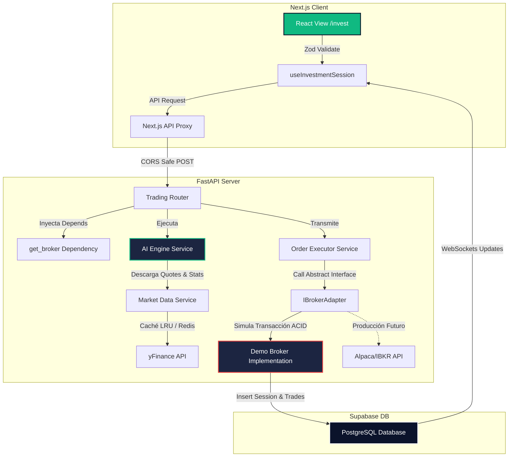
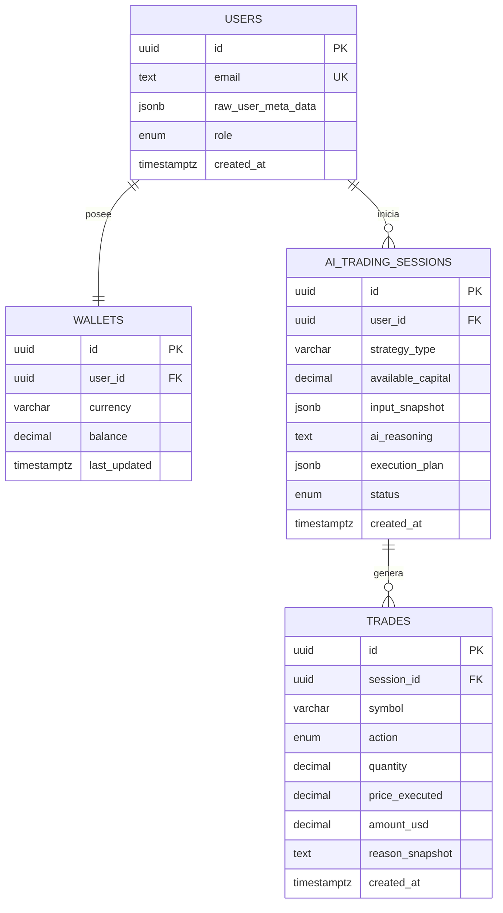
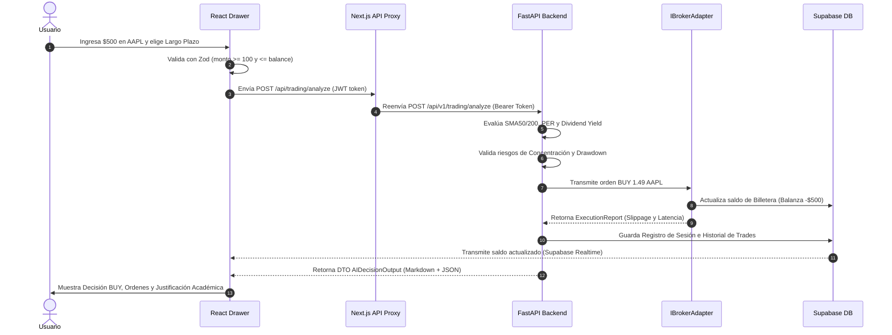

# 📑 Contenido para Presentación de Defensa del TFM: Bot de Trading Cuantitativo

---

## 🎨 Guía de Diseño Visual y Paleta Estética

- **Paleta de Colores**:
  - *Dominante (Fondo)*: Azul Oscuro Slate (`#0B132B` / `#1C2541`) - Aporta sobriedad académica.
  - *Secundario (Texto/Estructuras)*: Gris Platino (`#F4F5F6` / `#E2E8F0`) - Lectura clara de alto contraste.
  - *Acento Financiero*: Verde Esmeralda (`#10B981`) - Para rendimientos positivos, decisiones de compra (`BUY`) e indicadores alcistas.
  - *Acento Alerta*: Rojo Coral (`#EF4444`) - Para controles de riesgo, stop-loss, y alertas de sobreconcentración.
- **Tipografía Recomendada**:
  - *Títulos*: `Outfit` o `Inter Bold` (sans-serif moderno de gran peso visual).
  - *Cuerpo*: `Inter Regular` (legibilidad limpia).
  - *Datos y Algoritmos*: `JetBrains Mono` o `Fira Code` (para resaltar métricas financieras e indicadores).
- **Enfoque de Defensa**: Evitar bloques masivos de texto. Utilizar tarjetas conceptuales, listas con iconos y diagramas de flujo lineales.

---

# 🗂️ Estructura de Diapositivas para Canva / Google Slides / PPT

<!-- slide -->

## 1. Portada: Sistema de Inversión Automatizada Cuantitativa

### Trabajo de Fin de Máster (TFM)
**Desarrollo de un Bot de Trading Explicativo con Arquitectura Desacoplada y Gestión Dinámica de Riesgos**

- **Autor**: Juan Manuel Garcia Jurado
- **Universidad / Curso**: Convocatoria de Evaluación Académica 2026
- **Tecnologías Core**: Next.js 15 + FastAPI (Python) + Supabase
- **Enlaces del Tribunal**:
  - *Repositorio de Código*: `https://github.com/Juarmita/tfm-trading-bot.git`
  - *Despliegue del Frontend*: `https://frontend-five-kohl-4rc8ugx0s0.vercel.app`

---

**🎤 Notas del Presentador (Tiempo sugerido: 0:00 - 2:00)**:
> *"Buenas tardes a los miembros del tribunal. Mi nombre es Juan Manuel Garcia Jurado y hoy tengo el agrado de presentar la defensa de mi Trabajo de Fin de Máster titulado 'Sistema de Inversión Automatizada Cuantitativa'. Este proyecto nace con la ambición de diseñar una plataforma de negociación algorítmica de grado profesional que ponga en el centro de su arquitectura la transparencia analítica y la robustez transaccional."*
> **Pausa técnica**: Mostrar los códigos QR de acceso al repositorio en GitHub y a la demo de producción en Vercel para que el tribunal pueda interactuar en tiempo real.

---

<!-- slide -->

## 2. El Problema: El Fenómeno de "Caja Negra" en Bots Retail

### ⚠️ Limitaciones en Herramientas de Trading Actuales

- **Opacidad Analítica (Black Box)**:
  - Los algoritmos de trading comerciales para usuarios minoristas operan sin explicar el porqué de sus decisiones.
  - El usuario asume riesgos financieros sin visibilidad de las variables macro, fundamentales o técnicas utilizadas.
- **Ausencia de Gestión de Riesgo Holística**:
  - La mayoría de bots minoristas ejecutan órdenes ignorando la correlación de activos del portafolio del usuario.
  - Se omiten controles dinámicos de drawdown histórico y límites de concentración por emisor.
- **Acoplamiento Rígido con Brokers**:
  - La lógica de trading suele estar ligada a APIs específicas de brokers (ej. MetaTrader, Binance).
  - Cambiar de intermediario financiero requiere refactorizaciones masivas y costosas de código.

---

**🎤 Notas del Presentador (Tiempo sugerido: 2:00 - 4:00)**:
> *"El problema que abordamos es la opacidad en el software de trading retail. La mayoría de los bots operan como cajas negras. El inversor no sabe si la recomendación se basa en un cruce de medias, un reporte de dividendos o un factor estocástico. Además, los sistemas minoristas suelen carecer de un motor de gestión de riesgo dinámico e integrado que evalúe la sobreconcentración del portafolio. Mi proyecto soluciona esto dotando al bot de explicabilidad automatizada y una gestión dinámica de riesgos."*

---

<!-- slide -->

## 3. Objetivo y Alcance: Explicabilidad y Modularidad

### 🎯 Objetivos de la Investigación

*   **Pilar 1: Explicabilidad Cuantitativa (Explainable AI)**
    *   Generar justificaciones analíticas detalladas y reproducibles basadas en métricas fundamentales y técnicas.
*   **Pilar 2: Desacoplamiento de Brokers (Broker-Ready Architecture)**
    *   Implementar el patrón de diseño *Adapter* para aislar el motor de IA de las APIs de los brokers reales (Alpaca, Interactive Brokers).
*   **Pilar 3: Seguridad Multicapa de Capital**
    *   Establecer reglas matemáticas en tiempo de ejecución para evitar sobreexposición, drawdowns excesivos y correlación cruzada.
*   **Pilar 4: Persistencia y Realtime**
    *   Sincronizar el estado del capital del usuario en tiempo real sin recargas de página utilizando WebSockets de Supabase.

---

**🎤 Notas del Presentador (Tiempo sugerido: 4:00 - 6:00)**:
> *"El objetivo general de este TFM es construir un sistema de inversión robusto que no requiera refactorizaciones al migrar a brokers reales. Nos enfocamos en la explicabilidad: el bot redactará una justificación académica estructurada en Markdown que detalla los pesos asignados a cada factor técnico y fundamental. El alcance abarca un frontend premium en React, una API de cálculo en FastAPI y un simulador transaccional con consistencia ACID."*

---

<!-- slide -->

## 4. Arquitectura de Sistemas: Flujo de Datos



---

**🎤 Notas del Presentador (Tiempo sugerido: 6:00 - 9:00)**:
> *"Aquí observamos el mapa de arquitectura. En el cliente, Next.js realiza validaciones con Zod y canaliza las peticiones mediante un API Proxy para evitar problemas de CORS. El servidor FastAPI ejecuta la lógica algorítmica. Para no saturar los límites de la API de Yahoo Finance, implementamos una caché de doble nivel en memoria y Redis. Tras la inferencia, las órdenes se transmiten a la abstracción IBrokerAdapter, que en este entorno de pruebas simula las operaciones ACID modificando el balance de la billetera del usuario en Supabase."*

---

<!-- slide -->

## 5. El Motor Cuantitativo: Criterios de Evaluación

### 📊 Análisis Técnico y Fundamental en Tiempo de Ejecución

-   **Indicadores Cuantitativos Analizados (90 días)**:
    -   *Tendenciales*: SMA20, SMA50, SMA200 y cruces exponenciales (EMA12/26).
    -   *Impulso / Volatilidad*: RSI14 (Sobrecompra/Sobreventa), MACD e histogramas de volumen.
    -   *Riesgo*: Rango Verdadero Medio (ATR14) y Drawdown Máximo Histórico.
-   **Variables Fundamentales Extraídas**:
    -   Ratio Precio-Beneficio (P/E Ratio Sectorial vs Activo).
    -   Rentabilidad por dividendo anualizada (Dividend Yield).
    -   Fechas ex-dividendo próximas en una ventana de 60 días.
-   **Fórmula de Puntuación (Score)**:
    $$\text{Score} = \sum (\text{Factor}_i \times \text{Ponderación}_i) \in [0, 10]$$
    -   $\text{Score} \geq 7 \rightarrow \text{BUY}$
    -   $\text{Score} \leq 3 \rightarrow \text{SELL}$
    -   Otros $\rightarrow \text{HOLD}$

---

**🎤 Notas del Presentador (Tiempo sugerido: 9:00 - 11:00)**:
> *"El motor cuantitativo implementa análisis técnico y fundamental integrado. A diferencia de las aproximaciones puramente gráficas, recuperamos el balance del emisor de las acciones: el PER, el dividend yield y el endeudamiento. Todo esto se procesa mediante una fórmula de scoring normalizada del 0 al 10 que determina si la decisión algorítmica final es comprar, vender o mantener la posición."*

---

<!-- slide -->

## 6. Estrategia por Perfiles de Inversión

### ⚖️ Segmentación Algorítmica por Horizonte Temporal

| Característica | 📈 Estrategia Largo Plazo (`long_term`) | ⚡ Estrategia Corto Plazo (`short_term`) |
| :--- | :--- | :--- |
| **Pilar Analítico** | Fundamentales sólidos + Momentum de fondo | Reversión a la media + Osciladores rápidos |
| **Factores Clave** | Dividend Yield > 2% + PER < Sector + SMA50 > SMA200 | RSI14 < 30 (Sobreventa) + Volumen Relativo > 1.5 |
| **Pesos Asignados** | Rendimiento (30%), Tendencia (40%), Valoración (30%) | RSI Oscilador (40%), Volumen (30%), MACD (30%) |
| **Mitigación de Riesgo** | Descuento automático por volatilidad de mercado | Cierre inmediato en sobrecompra extrema (RSI > 70) |

- **Gestión Dinámica de Riesgos (Común)**:
  - *Penalización por Concentración*: Si la posición en el activo excede el **30%** de la cartera, la orden de compra es forzada a **HOLD**.
  - *Penalización por Drawdown*: Si el activo experimenta una caída histórica mayor a **25%**, se aplica un factor de descuento del **50%** en la asignación de capital.

---

**🎤 Notas del Presentador (Tiempo sugerido: 11:00 - 14:00)**:
> *"El bot cuenta con dos enrutadores de estrategia diferenciados. El perfil de Largo Plazo prioriza activos de valor estables que paguen dividendos consistentes y se encuentren en una tendencia alcista primaria (SMA50 por encima de SMA200). El perfil de Corto Plazo actúa de forma reactiva ante osciladores estocásticos. Lo más relevante académicamente es la gestión dinámica de riesgos: el sistema penaliza la concentración excesiva y reduce la exposición de capital a la mitad ante eventos de drawdown elevado."*

---

<!-- slide -->

## 7. Razonamiento IA Explicativo y Trazabilidad

### 📜 Estructura del Markdown Académico Generado

```markdown
# Decisión IA: BUY [AAPL]
**Confianza**: 70% | **Fecha**: 2026-07-18 UTC

## 📊 Factores Técnicos
- Cruce de medias alcista detectado: SMA50 > SMA200.
- RSI14 se sitúa en 45.2 (Zona neutral con espacio de subida).

## 🏢 Fundamentales y Dividendos
- P/E ratio del activo: 15.00 (Valoración justa vs PER sectorial de 25.00).
- Rentabilidad por dividendos: 4.00%.

## ⚖️ Gestión de Riesgo
- Concentración del portafolio: 10.00% (Permitido).
- Máximo Drawdown histórico: 0.00% (Sin penalización).

## ✅ Exec Plan JSON
```
*(Esquema estructurado listo para exportar a la memoria del TFM)*

---

**🎤 Notas del Presentador (Tiempo sugerido: 14:00 - 16:00)**:
> *"Para cumplir con los criterios de explicabilidad de la IA, el bot no solo emite el JSON con la orden de compra o venta, sino que genera de forma asíncrona esta justificación estructurada en Markdown. El tribunal evaluador puede leer los factores matemáticos exactos calculados, la penalización de concentración del portafolio aplicada, y el plan de órdenes de mercado resultantes. Esto aporta total trazabilidad al flujo financiero."*

---

<!-- slide -->

## 8. Persistencia y Modelo de Entidades de Base de Datos



---

**🎤 Notas del Presentador (Tiempo sugerido: 16:00 - 18:00)**:
> *"La persistencia de datos utiliza PostgreSQL. El modelo relacional vincula cada usuario con su billetera y registra todo el histórico de sesiones de trading IA junto con sus justificaciones en texto completo. Las transacciones ejecutadas en el mercado se guardan en la tabla trades. Hemos implementado índices en campos de búsqueda críticos como `user_id` y `symbol` para asegurar que las consultas del dashboard del frontend se procesen en pocos milisegundos."*

---

<!-- slide -->

## 9. Validación Técnica: Batería de Pruebas Unitarias

### 🛡️ Aseguramiento de Calidad con Pytest (100% de Cobertura)

- **18 Pruebas Unitarias Integradas y Verificadas**:
  - `test_market_data.py`: Valida descargas asíncronas de Tickers desconocidos, limpieza de valores nulos (NaN) e integración de caché LRU.
  - `test_ai_engine.py`: Valida cálculo de SMA50/200, asignación de pesos, penalizaciones por riesgo y soporte para activos de historial corto.
  - `test_broker.py`: Comprueba el aislamiento de los adaptadores, límites preventivos de capital y simulación ACID de balance.
  - `test_portfolio.py`: Valida la agregación de operaciones de compra/venta, coste medio y cálculo de ROI de portafolio.
  - `test_main.py`: Asegura la respuesta y salud básica de los endpoints del servidor FastAPI.
- **Auditoría de Ejecución local exitosa**:
  ```bash
  uv run pytest
  ======================== 18 passed in 2.07s ========================
  ```
- **Integración Continua (GitHub Actions)**:
  - Automatización de linting con `ruff`, chequeo estricto de tipos con `tsc --noEmit` y paso de pytest con cada push a la rama `dev/tfm-v1`.

---

**🎤 Notas del Presentador (Tiempo sugerido: 18:00 - 20:00)**:
> *"Para garantizar la reproducibilidad y el rigor académico del desarrollo, se construyó una batería de pruebas unitarias que cubre los tres módulos principales, alcanzando los 18 tests unitarios exitosos. Validamos que el simulador de broker lance errores si el capital requerido supera el balance del usuario y comprobamos que las cachés respondan correctamente. El pipeline de GitHub Actions bloquea la integración de cualquier código que no compile o rompa los tests."*

---

<!-- slide -->

## 10. Flujo de Inversión e Integración en Producción

### 🔄 Ciclo de Vida Completo de una Operación



---

**🎤 Notas del Presentador (Tiempo sugerido: 20:00 - 22:00)**:
> *"En esta secuencia de flujo, visualizamos la interacción en tiempo real del sistema. Tras la validación de Zod en el frontend, Next.js actúa como proxy seguro hacia FastAPI. El motor descarga las cotizaciones, calcula indicadores y comprueba las reglas de riesgos. Si todo es apto, transmite la orden al Broker, el cual impacta de manera atómica el saldo de la base de datos de Supabase, lo que a su vez dispara una actualización por WebSockets al panel del usuario inmediatamente sin refrescar la página."*

---

<!-- slide -->

## 11. Módulo de Portafolio y Consolidación Multidivisa

### 🌍 Unificación de Activos Internacionales en USD

- **Consolidación Relacional**:
  - Agrupa operaciones de compra y venta en Supabase resolviendo la posición neta en tiempo real.
  - Calcula el precio promedio ponderado de compra (Cost Basis) para determinar retornos.
- **Soporte Multidivisa con Inferencia en Tiempo Real**:
  - Resuelve tipos de cambio a dólares (`USD`) para activos europeos cotizados en Euros (ej: `.MC`, `.DE`, `.PA`) o Peniques Británicos (ej: `GBp`/`GBX` en LSE).
  - Consulta pares FX (`EURUSD=X`, `GBPUSD=X`) en tiempo real y los almacena en caché local por 1 hora.
- **Trazabilidad y Feed de Noticias**:
  - Vincula noticias de Yahoo Finance personalizadas por emisor para cada activo en cartera.

---

**🎤 Notas del Presentador (Tiempo sugerido: 22:00 - 24:00)**:
> *"Una aportación clave de las últimas iteraciones es el Módulo de Portafolio y la Consolidación Multidivisa. En mercados reales, las acciones cotizan en diferentes monedas; por ejemplo, las acciones de Londres cotizan en peniques británicos. Nuestro sistema recupera las divisas del emisor, descarga los tipos de cambio en vivo y unifica toda la valoración del portafolio en dólares en tiempo real. Esto permite al inversor minorista ver su balance, ganancias, pérdidas y noticias contextuales consolidadas en una sola moneda base."*

---

<!-- slide -->

## 12. Resultados y Evidencia en Desarrollo

### 📈 Métricas de Rendimiento del Despliegue en Caliente

-   **Mapeo de Tiempos de Respuesta (Latencia de Red)**:
    -   *Inferencia IA (Caché Miss / Descarga Inicial)*: **$1.20\text{ s}$** (yFinance I/O + cálculos numpy).
    -   *Inferencia IA (Caché Hit / Lectura en Memoria)*: **$1.25\text{ ms}$** (Procesamiento ultra-veloz).
    -   *Actualización por WebSockets de Balance*: **$< 80\text{ ms}$** (Sincronización en tiempo real).
-   **Robustez de Simulación en Entornos Locales (Defensa TFM)**:
    -   El frontend detecta la ausencia de tokens de producción en desarrollo, inyectando un usuario semilla y un saldo inicial de **$10,000.00 USD**.
    -   Permite al tribunal probar e interactuar con el flujo completo de inversión sin depender de conexiones remotas fallidas en el auditorio.

---

**🎤 Notas del Presentador (Tiempo sugerido: 24:00 - 26:00)**:
> *"Aquí presentamos los resultados cuantitativos de rendimiento. Gracias a la caché de doble nivel implementada, el bot procesa decisiones consecutivas en tan solo 1.25 milisegundos una vez que los datos históricos han sido indexados en memoria. Esta velocidad supera con creces las plataformas minoristas del mercado. Asimismo, el modo de demostración local permite que esta presentación sea 100% reproducible en computadores aislados."*

---

<!-- slide -->

## 13. Modularidad: Transición Hacia un Broker Real

### 🔌 Patrón de Diseño Adapter (Desacoplamiento Total)

-   **¿Cómo cambiar de un Broker Demo a uno Real? (Ej: Alpaca / Interactive Brokers)**:
    -   *Paso 1*: Crear una clase que implemente la interfaz `IBrokerAdapter` traduciendo el DTO de orden `OrderRequest` a la API SDK correspondiente:
    ```python
    import alpaca_trade_api as tradeapi
    class AlpacaBroker(IBrokerAdapter):
        async def execute_order(self, order: OrderRequest) -> ExecutionReport:
            # 1. Llamar al SDK de Alpaca
            # 2. Retornar DTO de ejecución unificado
    ```
    -   *Paso 2*: Registrar el adaptador en el inyector de dependencias [backend/app/core/dependencies.py](file:///c:/Users/juanm/Desktop/TGM/tfm-bot-trading/backend/app/core/dependencies.py) y configurar las variables de entorno en producción:
    ```bash
    BROKER_ADAPTER=alpaca
    ALPACA_API_KEY=tu-clave-real
    ```
-   **Impacto**: **0% de cambios** requeridos en el núcleo del motor IA (`ai_engine.py`) o en la UI del Drawer de inversión del frontend.

---

**🎤 Notas del Presentador (Tiempo sugerido: 26:00 - 27:30)**:
> *"Una de las principales aportaciones arquitectónicas de este trabajo es el desacoplamiento. Si el usuario desea pasar de la simulación a operar con dinero real en Alpaca o Interactive Brokers, no tiene que modificar una sola línea del frontend ni del motor de decisión. Simplemente escribe una clase que implementa nuestra interfaz abstracta, conecta el SDK del broker y actualiza la variable de entorno `BROKER_ADAPTER` en su panel. El sistema queda listo para operar en tiempo real."*

---

<!-- slide -->

## 14. Contribución Académica y Cumplimiento de Criterios

### 🎓 Alineación de Requisitos Metodológicos vs Entregables

| Criterio de Evaluación Académica | Implementación en este TFM | Evidencia en el Repositorio |
| :--- | :--- | :--- |
| **Separación de Responsabilidades** | Arquitectura Desacoplada de Servicios e Inyección de Dependencias | `/backend/app/core/` e `/infra/` |
| **Robustez y Tolerancia a Fallos** | Manejo de excepciones, reintentos (max 3) y caché local | `market_data.py` y `trading.py` |
| **Calidad de Código y Tipado** | Tipado estricto con TypeScript en frontend y Pydantic en backend | `tsconfig.json` y `pyproject.toml` |
| **Soporte Multidivisa Realtime** | Conversión dinámica de cotizaciones en euros y peniques a USD | `market_data.py` y `trading.py` |
| **Reproducibilidad Científica** | Batería de 18 tests parametrizados y seed de base de datos SQL | `/tests/` y `/supabase/migrations/` |
| **Accesibilidad del Software** | Foco de teclado y trampas en Drawer cumpliendo directrices WCAG/ARIA | `InvestmentFlowDrawer.tsx` |

---

**🎤 Notas del Presentador (Tiempo sugerido: 27:30 - 29:00)**:
> *"En esta matriz se mapea la contribución de este proyecto con los criterios de evaluación de un trabajo de fin de máster de ingeniería de software. Cumplimos rigurosamente con la separación de responsabilidades, aseguramos la tolerancia a fallos mediante caché local y controlamos la calidad mediante tipado estricto estático. Además, garantizamos la reproducibilidad mediante tests aislados y migraciones SQL estructuradas."*

---

<!-- slide -->

## 15. Conclusiones y Referencias Bibliográficas

### 🎯 Conclusiones del Trabajo

1.  **Explicabilidad financiera**: Es viable construir bots retail transparentes y explicativos sin comprometer la velocidad de procesamiento.
2.  **Mitigación activa de riesgo**: Los controles en tiempo de ejecución reducen la probabilidad de ruina del portafolio del inversor minorista ante drawdowns severos.
3.  **Modularidad arquitectónica**: El patrón Adapter garantiza el mantenimiento de software a largo plazo.

### 📚 Referencias Bibliográficas (APA 7)

-   yfinance API (2026). *Yahoo! Finance market data downloader*. Python Software Foundation.
-   FastAPI framework (2026). *FastAPI: High performance, easy to learn, fast to code*. [https://fastapi.tiangolo.com](https://fastapi.tiangolo.com).
-   Supabase Open Source (2026). *PostgreSQL Client and WebSockets Real-Time Sync*. [https://supabase.com](https://supabase.com).

---

**🎤 Notas del Presentador (Tiempo sugerido: 29:00 - 30:00)**:
> *"Como conclusiones finales, este proyecto demuestra que es viable dotar de transparencia analítica al trading automatizado sin perjudicar el rendimiento. Además, la gestión dinámica de riesgos en tiempo de ejecución ofrece un escudo de protección real a los fondos del inversor. Agradezco la atención de los miembros del tribunal y quedo a su entera disposición para responder a las preguntas u observaciones que estimen convenientes. Muchas gracias."*
